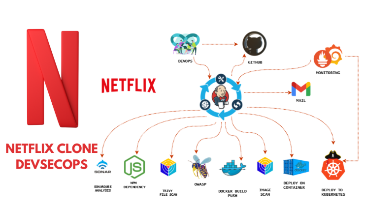
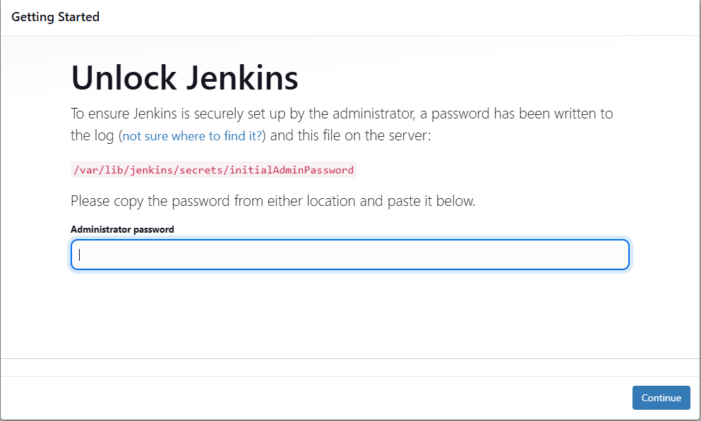
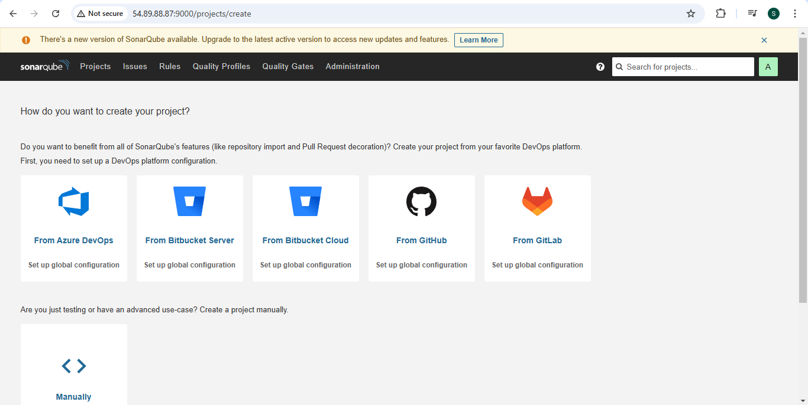
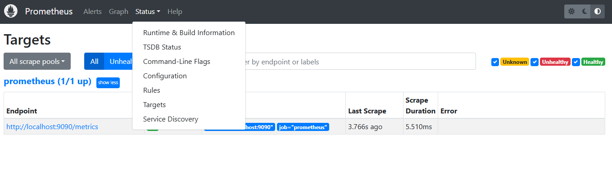
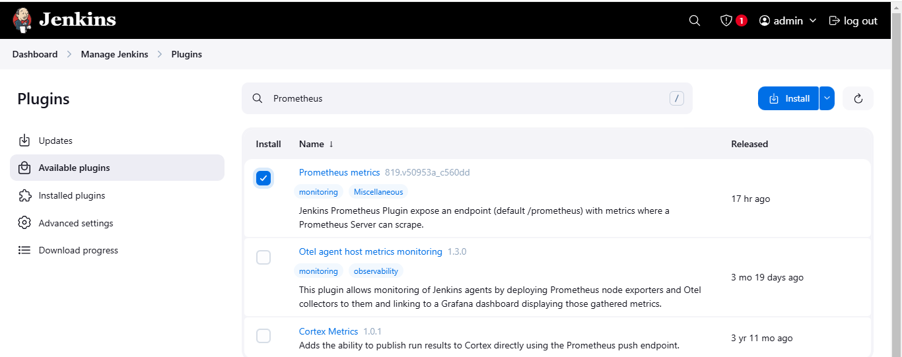

# 🎬 Netflix Clone - DevSecOps Project

## 🚀 Project Overview
This project follows a **DevSecOps** approach to deploy and secure a Netflix clone application using **Jenkins, Docker, Kubernetes, SonarQube, and Trivy**. It includes CI/CD, security scanning, monitoring, and deployment on AWS.

## Architecture Overview



---

## 🔹 Infra Build and tools prerequisites

## Step 1 — Launch AWS Infrastructure
- Launch an **Ubuntu 22.04 T2 Large**  with an elastic IP associated with the VM (to have the same public IP incase of mutiple restarts)

## Step 2 — Installtion of Jenkins, docker and trivy

**Jenkins**
 is an open-source automation server used for CI/CD (Continuous Integration/Continuous Deployment). It automates the build, test, and deployment process of software development and integrates with various tools like Git, Docker, Kubernetes, and Trivy.

```sh
vi jenkins.sh

#!/bin/bash
sudo apt update -y
#sudo apt upgrade -y
wget -O - https://packages.adoptium.net/artifactory/api/gpg/key/public | tee /etc/apt/keyrings/adoptium.asc
echo "deb [signed-by=/etc/apt/keyrings/adoptium.asc] https://packages.adoptium.net/artifactory/deb $(awk -F= '/^VERSION_CODENAME/{print$2}' /etc/os-release) main" | tee /etc/apt/sources.list.d/adoptium.list
sudo apt update -y
sudo apt install temurin-17-jdk -y
/usr/bin/java --version
curl -fsSL https://pkg.jenkins.io/debian-stable/jenkins.io-2023.key | sudo tee \
                  /usr/share/keyrings/jenkins-keyring.asc > /dev/null
echo deb [signed-by=/usr/share/keyrings/jenkins-keyring.asc] \
                  https://pkg.jenkins.io/debian-stable binary/ | sudo tee \
                              /etc/apt/sources.list.d/jenkins.list > /dev/null
sudo apt-get update -y
sudo apt-get install jenkins -y
sudo systemctl start jenkins
sudo systemctl status jenkins

sudo chmod 777 jenkins.sh
./jenkins.sh    # this will installl jenkins

```

- After installing Jenkins, update your AWS EC2 Security Group to allow inbound traffic on port 8080, as      Jenkins operates on this port.
- Access the application by entering your EC2 Public IP Address followed by port 8080.
```sh

 http://<<EC2-PublicIP>>:8080/

```
- Jenkins Dashboard view



**Docker**
 is a containerization platform that allows developers to package applications and dependencies into lightweight, portable containers. It enables efficient deployment, scaling, and management of applications in different environments.

```sh
vi docker.sh

sudo apt-get update
sudo apt-get install docker.io -y
sudo usermod -aG docker $USER   #my case is ubuntu
newgrp docker
sudo chmod 777 /var/run/docker.sock

```
**SonarQube**
 is a continuous code quality and security analysis tool that detects bugs, vulnerabilities, and code smells in source code. It integrates with CI/CD pipelines and supports multiple programming languages.

- After installing Docker, deploy a SonarQube container (ensure port 9000 is open in the security group).

```sh
docker run -d --name sonar -p 9000:9000 sonarqube:lts-community

```
- Sonarqube Dashboard view



**Trivy** 
 is an open-source vulnerability scanner for containers, file systems, and code repositories. It detects vulnerabilities, misconfigurations, and exposed secrets. It is widely used in DevOps pipelines for security compliance.

```sh
vi trivy.sh

sudo apt-get install wget apt-transport-https gnupg lsb-release -y
wget -qO - https://aquasecurity.github.io/trivy-repo/deb/public.key | gpg --dearmor | sudo tee /usr/share/keyrings/trivy.gpg > /dev/null
echo "deb [signed-by=/usr/share/keyrings/trivy.gpg] https://aquasecurity.github.io/trivy-repo/deb $(lsb_release -sc) main" | sudo tee -a /etc/apt/sources.list.d/trivy.list
sudo apt-get update
sudo apt-get install trivy -y

```

## Step 3 — Obtain the TMDB API Key

To integrate with The Movie Database (TMDB) and access movie-related data, you need an API key. The TMDB API allows developers to fetch movie details, ratings, images, and more for applications. Follow the steps below to generate your API key:

- Use a VPN (For Users in India) – Since TMDB is currently inaccessible in India, enable a VPN and connect to a different region where the website is available.
- Visit the TMDB Website – Open a web browser and navigate to TMDB (The Movie Database).
- Sign In or Register – Click on "Login" and sign in to your account. If you don’t have one, create a new account.
- Access API Settings – Once logged in, go to your profile settings by clicking on your profile icon and selecting “Settings.”
- Generate an API Key – In the left-side menu, click on “API” and choose the option to create a new API key.
- Accept Terms & Provide Details – Agree to the terms and conditions, fill in the required details, and submit your request.
- Retrieve Your API Key – Once approved, your unique API key will be generated and displayed.

Why is the TMDB API Key Needed?
- The API key acts as an authentication mechanism that allows your application to access TMDB’s vast database of movies, TV shows, and related metadata. It enables fetching movie details, searching for films, displaying posters, and integrating movie-related content into your project.

## 🔹 Monitoring Tools installation

## Step 1 — Installing Prometheus
- Launch an **Ubuntu 22.04 T2 Large**  with an elastic IP associated with the VM (to have the same public IP incase of mutiple restarts)

**Prometheus** 
 is an open-source monitoring and alerting tool designed for recording real-time metrics in a time-series database. It is widely used for infrastructure monitoring, particularly in cloud environments and Kubernetes clusters.

To ensure Prometheus runs efficiently as a background service, we will:

- Create a dedicated system user for Prometheus.
- Download and configure Prometheus.
- Set up a systemd service to manage Prometheus automatically.

To run Prometheus with restricted privileges, we create a dedicated Linux user:

```sh
sudo useradd --system --no-create-home --shell /bin/false prometheus
```
This prevents Prometheus from logging into the system and enhances security.

Extract Prometheus files, move them, and create directories:

```sh
tar -xvf prometheus-2.47.1.linux-amd64.tar.gz
cd prometheus-2.47.1.linux-amd64/
sudo mkdir -p /data /etc/prometheus
sudo mv prometheus promtool /usr/local/bin/
sudo mv consoles/ console_libraries/ /etc/prometheus/
sudo mv prometheus.yml /etc/prometheus/prometheus.yml
```

To ensure Prometheus has the correct permissions, set ownership for the configuration and data directories:

```sh
sudo chown -R prometheus:prometheus /etc/prometheus/ /data/
```

To manage Prometheus as a background service, we define a systemd unit file:

```sh
sudo nano /etc/systemd/system/prometheus.service

[Unit]
# Description of the service
Description=Prometheus  

# Ensures Prometheus starts after the network is available
Wants=network-online.target  
After=network-online.target  

# Service restart settings
StartLimitIntervalSec=500  
StartLimitBurst=5  

[Service]
# Run Prometheus as the prometheus user
User=prometheus  
Group=prometheus  

# Run the service as a simple process
Type=simple  

# Restart settings in case of failure
Restart=on-failure  
RestartSec=5s  

# Command to start Prometheus with required configurations
ExecStart=/usr/local/bin/prometheus \  
  --config.file=/etc/prometheus/prometheus.yml \  # Specify the configuration file
  --storage.tsdb.path=/data \  # Define the directory to store time-series data
  --web.console.templates=/etc/prometheus/consoles \  # Location for web console templates
  --web.console.libraries=/etc/prometheus/console_libraries \  # Console libraries
  --web.listen-address=0.0.0.0:9090 \  # Listen on all network interfaces on port 9090
  --web.enable-lifecycle  # Enable API-based management  

[Install]
# Ensure the service starts on boot
WantedBy=multi-user.target  

# Enable Prometheus to start on system boot
sudo systemctl enable prometheus  

# Start the Prometheus service
sudo systemctl start prometheus  

# Check the status of the Prometheus service
sudo systemctl status prometheus  

```
Access Prometheus in a web browser using the server's IP and port 9090:


- Prometheus Dashboard view

We can see the local host present as the data source which is up and running on port 9090



## Step 2 — Installing Node Exporter

**Node Exporter** 

 is an essential component of Prometheus-based monitoring. It is a lightweight agent that collects and exposes system-level metrics from a Linux server, making them available for Prometheus to scrape and analyze.

```sh
# Create a dedicated system user for Node Exporter without a home directory or login shell
sudo useradd --system --no-create-home --shell /bin/false node_exporter  

# Download the latest Node Exporter package
wget https://github.com/prometheus/node_exporter/releases/download/v1.6.1/node_exporter-1.6.1.linux-amd64.tar.gz  

# Extract the downloaded archive
tar -xvf node_exporter-1.6.1.linux-amd64.tar.gz  

# Move the Node Exporter binary to a system-wide location
sudo mv node_exporter-1.6.1.linux-amd64/node_exporter /usr/local/bin/  

# Remove the extracted files to clean up unnecessary data
rm -rf node_exporter*  

# Create a systemd service file to manage Node Exporter as a system service
sudo nano /etc/systemd/system/node_exporter.service  

```
## Step 3 — Integrating Jenkins and NodeExporter with Prometheus

Integrating Jenkins with Prometheus to monitor the CI/CD pipeline.

To enable Prometheus to scrape metrics from both Node Exporter and Jenkins, update the prometheus.yml configuration file as shown below:

```sh
sudo cat /etc/prometheus/prometheus.yml

# my global config
global:
  scrape_interval: 15s # Set the scrape interval to every 15 seconds. Default is every 1 minute.
  evaluation_interval: 15s # Evaluate rules every 15 seconds. The default is every 1 minute.
  # scrape_timeout is set to the global default (10s).

# Alertmanager configuration
alerting:
  alertmanagers:
    - static_configs:
        - targets:
          # - alertmanager:9093

# Load rules once and periodically evaluate them according to the global 'evaluation_interval'.
rule_files:
  # - "first_rules.yml"
  # - "second_rules.yml"

# A scrape configuration containing exactly one endpoint to scrape:
# Here it's Prometheus itself.
scrape_configs:
  # The job name is added as a label `job=<job_name>` to any timeseries scraped from this config.
  - job_name: "prometheus"

    # metrics_path defaults to '/metrics'
    # scheme defaults to 'http'.

    static_configs:
      - targets: ["localhost:9090"]

  - job_name: "node_export"
    static_configs:
      - targets: ["localhost:9100"]
  - job_name: "jenkins"
    metrics_path: "/prometheus"
    static_configs:
      - targets: ["<your-jenkins-ip>:8080"]

```
Run the following command to check if the configuration file is correctly formatted:

```sh
promtool check config /etc/prometheus/prometheus.yml
```

Instead of restarting the Prometheus service, apply the new configuration dynamically:

```sh
curl -X POST http://localhost:9090/-/reload
```

Installing the Prometheus plugin in Jenkins is required to enable metric scraping by Prometheus.



We can verify that the targets are healthy and visible on the Prometheus application

```sh
http://<ip>:9090/targets
```


## Step 2 — Installing Grafana

**Grafana** 

Grafana is essential for visualizing and analyzing metrics collected by Prometheus from Jenkins and Node Exporter. While Prometheus efficiently gathers and stores time-series data, its built-in UI is limited in terms of visualization. Grafana enhances monitoring by providing interactive dashboards, real-time graphs, and alerts, making it easier to track system performance. It allows users to customize views, correlate metrics, and receive notifications based on predefined thresholds. By integrating Grafana into our setup, we create a complete monitoring solution where Prometheus handles data collection, and Grafana presents that data in an intuitive and insightful manner for better decision-making and troubleshooting.


### **Step 2 — CI/CD Pipeline with Jenkins**
- Install required Jenkins plugins:  
  - **JDK**, **SonarQube Scanner**, **NodeJS**, **OWASP Dependency Check**
- Configure a **Declarative Pipeline** in Jenkins.
- Integrate Jenkins with GitHub.

### **Step 3 — Docker & Kubernetes Deployment**
- Build a **Docker Image** for the Netflix Clone.
- Push the image to **DockerHub**.
- Deploy the image using Docker.
- Set up **Kubernetes Master & Worker nodes** on Ubuntu 20.04.
- Deploy the application using **K8s manifests**.

### **Step 4 — Monitoring & Logging**
- Install **Prometheus & Grafana** on a monitoring server.
- Install **Prometheus Plugin** in Jenkins.
- Set up **Grafana dashboards** to monitor Jenkins & Kubernetes.

### **Step 5 — Notifications & Cleanup**
- Configure **Email Integration** in Jenkins.
- Automate EC2 **termination** after the project completion.

---

## 🔹 SecOps Section
### **Step 6 — Security Scanning & Code Quality**
- Install and configure **SonarQube** (Docker Container).
- Perform **static code analysis** on the Netflix Clone repository.

### **Step 7 — Vulnerability Scanning**
- Install **Trivy** for container security scanning.
- Scan the Docker images before deployment.

### **Step 8 — Dependency Scanning**
- Install **OWASP Dependency Check** Plugin in Jenkins.
- Scan project dependencies for security vulnerabilities.

---

## 🎯 Final Outcome
Once all steps are completed, the **Netflix Clone App** will be accessible in the browser, running on a secure and optimized DevSecOps pipeline. 🚀

